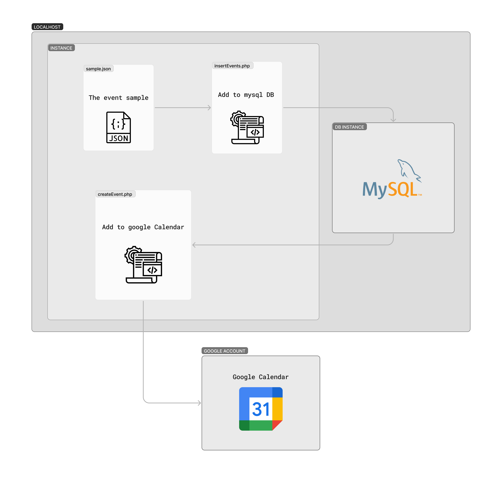

# mysql-to-google-calendar

This is a standalone PHP script to extract information from a MySQL database and send it to a Google Calendar.

## Diagram

<p align="center" width="100%">
    
</p>

## Installation

1. Clone this repository to your local environment.
2. Make sure you have Composer installed.
3. Run the `composer install` command to install project dependencies.

## Configuration

1. Create a `credentials.json` file in the root of the project and add the credentials for your Google service account.
2. Set the required environment variables in the `.env` file in the root of the project.

## Usage

1. Open the `sample.json` file and fill in the necessary parameters to create an event in the Google Calendar.
2. Run the script from the command line.

    to insert data into mysql:
    
    ```bash
    php insertEvents.php
    ```
    to create the event in google calendar
    ```bash
    php createEvent.php
